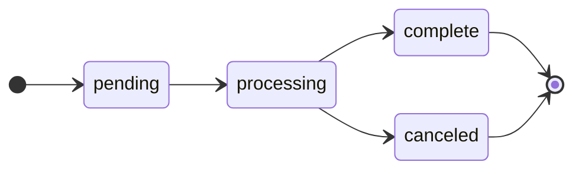

When you submit a [transfer](/key-concepts/transfers) through the Brale API, the time it takes to complete depends on the [`transfer_type`](/coverage/transfer-types) — the payment rail or blockchain network used to move value. This page documents the expected timing for each supported `transfer_type`.

<Warning>
  Settlement times are typical and not guaranteed. Actual times may vary based on bank processing, network congestion, or other factors.
</Warning>

- **Business days** exclude US federal holidays, weekends, and bank holidays.
- **Standard cut-off times** are the latest time a transfer can be submitted for same-day processing. Transfers submitted after the cut-off are queued for the next business day.
- For guaranteed SLAs or extended cut-off windows, MSAs are available.

## At a Glance

| `transfer_type`       | Rail                              | Settlement        | Availability     |
| --------------------- | --------------------------------- | ----------------- | ---------------- |
| `wire`                | Wire                              | ~2 hours          | US business days |
| `same_day_ach_credit` | Same-Day ACH                      | Same day          | US business days |
| `ach_credit`          | ACH Credit                        | 1–3 business days | US business days |
| `ach_debit`           | ACH Debit                         | 1–3 business days | US business days |
| `rtp_credit`          | RTP                               | Minutes           | 24/7/365         |
| Onchain (Tier 0)      | Monad, Radius                     | Under 10 seconds  | 24/7/365         |
| Onchain (Tier 1)      | Avalanche, PulseChain, Solana, Stellar, etc.  | Under 30 seconds  | 24/7/365         |
| Onchain (Tier 2)      | Base, Celo, Optimism, etc.        | Under 60 seconds  | 24/7/365         |
| Onchain (Tier 3)      | Ethereum, Polygon, Arbitrum, etc. | Over 60 seconds   | 24/7/365         |

## Offchain Transfer Timing

All fiat cut-off times are in **Eastern Time (ET)** and apply on US business days only. Transfers submitted after 3PM ET are processed the next business day, with consideration that most wires require ~2 hours to fully reconcile.

See [Transfer Types](/coverage/transfer-types) for the full list of offchain `transfer_type` identifiers and [Value Types](/coverage/value-types) for supported fiat and stablecoin [`value_type`](/coverage/value-types) identifiers.

### Wire Transfer

| Property                | Value                |
| ----------------------- | -------------------- |
| `transfer_type`         | `wire`               |
| Cut-off time            | 5:00 PM ET           |
| Average Settlement time | 2 hours or less      |
| Availability            | US business days     |
| Direction               | Inbound and outbound |

Wire transfers settle within approximately 2 hours. To ensure same-day settlement, submit wires by 3:00 PM ET — this allows time for the ~2-hour reconciliation window before the 5:00 PM ET cut-off. Wires submitted after the recommended submission time of 3PM ET are processed on the next business day. Inbound wire recognition is also dependent on the sending bank's processing time, risk review, and compliance checks if there are abnormal patterns.

### Same-Day ACH Credit

| Property           | Value                                         |
| ------------------ | --------------------------------------------- |
| `transfer_type`    | `same_day_ach_credit`                         |
| Processing windows | 10:30 AM / 2:45 PM / 4:45 PM ET               |
| Settlement time    | Same day (by ~1:00 PM / 5:00 PM / 6:00 PM ET) |
| Availability       | US business days                              |
| Direction          | Outbound                                      |

Same-Day ACH operates in three daily processing windows set by the Federal Reserve. Transfers are batched into the next available window after submission. Settlement occurs approximately 2 hours after each window closes.

### ACH Credit

| Property        | Value             |
| --------------- | ----------------- |
| `transfer_type` | `ach_credit`      |
| Settlement time | 1–3 business days |
| Availability    | US business days  |
| Direction       | Outbound          |

Standard ACH credit transfers settle within 1 to 3 business days depending on the receiving bank.

### ACH Debit

| Property        | Value             |
| --------------- | ----------------- |
| `transfer_type` | `ach_debit`       |
| Settlement time | 1–3 business days |
| Availability    | US business days  |
| Direction       | Inbound           |

ACH debit (pull) transfers settle within 1 to 3 business days based on risk controls. ACH debits are subject to returns based on standard ACH returns and corrections. If an ACH debit is returned (for example, due to insufficient funds), the associated transfer will be canceled and you will need to re-initiate the transfer.

### RTP Credit

| Property        | Value        |
| --------------- | ------------ |
| `transfer_type` | `rtp_credit` |
| Settlement time | Minutes      |
| Availability    | 24/7/365     |
| Direction       | Outbound     |

Real-Time Payments (RTP) settle in minutes with immediate confirmation. RTP is available around the clock, including weekends and holidays. The recipient's bank must support the RTP network. RTP transfers are irrevocable once sent.

RTP is subject to the same reviews, internal conditions, and edge cases as ACH. The anticipated average time of an RTP transaction is 1 minute or more, with some financial institutions exceeding expectations to under 30 seconds.

## Onchain Transfer Timing

Onchain transfers (mint, burn, and convert operations) are processed as blockchain transactions. Settlement time depends on the network's finality characteristics. Brale typically confirms onchain transfers in under 30 seconds, though actual network finality varies depending on the transfer's state, network congestion, and other variables.

See [Transfer Types](/coverage/transfer-types) for the full list of onchain `transfer_type` identifiers and [Value Types](/coverage/value-types) for supported stablecoin [`value_type`](/coverage/value-types) identifiers.

<Info>
  **Time to Settlement** should be thought of as round-trip transaction time via the API to `complete` with polling time included.
</Info>

### Speed Tiers

Time to settle indicates end-to-end API averages to inform your time to first poll. It is not recommended to poll every second, as the end-to-end settlement time will be exceeded. As a best practice, begin polling at **25% of the time to settlement**. In scenarios with less network congestion, transactions commonly settle much faster.

To keep things simple, we group blockchain end-to-end settlement time via the API into speed tiers to set expectations. Actual on-chain confirmations may be faster — these averages are derived from transaction data across platform testing.

| Tier | Timing           |
| ---- | ---------------- |
| 0    | Under 10 seconds |
| 1    | Under 30 seconds |
| 2    | Under 60 seconds |
| 3    | Over 60 seconds  |

### Onchain Transfer Types

| `transfer_type` | Network           | Speed Tier |
| --------------- | ----------------- | ---------- |
| `monad`         | Monad             | 0          |
| `radius`        | Radius            | 0          |
| `avalanche`     | Avalanche         | 1          |
| `canton`        | Canton            | 1          |
| `pulsechain`    | PulseChain        | 1          |
| `solana`        | Solana            | 1          |
| `spark`         | Spark             | 1          |
| `stellar`       | Stellar           | 1          |
| `tempo`         | Tempo             | 1          |
| `xrp_ledger`    | XRP Ledger        | 1          |
| `algorand`      | Algorand          | 2          |
| `base`          | Base              | 2          |
| `celo`          | Celo              | 2          |
| `coreum`        | Coreum            | 2          |
| `optimism`      | Optimism          | 2          |
| `arbitrum`      | Arbitrum          | 3          |
| `classic`       | Ethereum Classic  | 3          |
| `ethereum`      | Ethereum          | 3          |
| `hedera`        | Hedera            | 3          |
| `kusama`        | Polkadot / Kusama | 3          |
| `polygon`       | Polygon PoS       | 3          |
| `xion`          | Xion              | 3          |

<Tip>
  As a best practice, begin polling at **25% of the expected settlement time** for your transfer type's speed tier. For example, for a Tier 1 network (~30 seconds), start your first poll at ~7 seconds.
</Tip>

## Transfer Status Lifecycle

Every transfer progresses through a series of statuses. You can check the current status by [polling the transfer endpoint](/api-reference/brale/get-transfer).



| Status       | Terminal | Description                                                                                                                                                                                                                                                                                                            |
| ------------ | -------- | ---------------------------------------------------------------------------------------------------------------------------------------------------------------------------------------------------------------------------------------------------------------------------------------------------------------------- |
| `pending`    | No       | The transfer has been submitted but is not yet in progress. For fiat transfers, this typically means the system is waiting for funds, confirmation from a correspondent, or the transfer is under review.                                                                                                              |
| `processing` | No       | The transfer is actively being processed. For onchain transfers, this includes signing, broadcasting, and awaiting network confirmation. If an onchain transaction encounters a transient error (such as a signing timeout or network congestion), Brale will automatically retry it while it remains in `processing`. |
| `complete`   | Yes      | The transfer has finalized and funds have arrived at the destination.                                                                                                                                                                                                                                                  |
| `canceled`   | Yes      | The transfer has been permanently canceled and will not be retried. This is the only terminal failure state.                                                                                                                                                                                                           |

<Note>
  `complete` and `canceled` are the only terminal statuses. If a transfer is in `pending` or `processing`, it is still in progress and may still complete. Do not treat a non-terminal status as a final outcome.
</Note>

### When Transfers Are Canceled

A transfer moves to `canceled` when a failure is unrecoverable. Common scenarios include:

- **ACH debit return** — The originating bank returned the debit (for example, due to insufficient funds). The associated mint is canceled. You should initiate a new transfer after the funding issue is resolved.
- **Wire rejection** — The sending or receiving bank rejected the wire.
- **Compliance or risk hold** — The transfer was flagged and could not proceed.

When a transfer is canceled, [submit a new transfer](/api-reference/brale/create-transfer) rather than expecting the original to be retried.

### Automatic Retries

For onchain transfers, Brale automatically retries transient failures such as signing timeouts or network congestion. While retries are in progress, the transfer status remains `processing`. You do not need to take any action — retries are handled internally with exponential backoff and the transfer will resolve to either `complete` or `canceled`.

There is no API endpoint to manually trigger a retry. If a transfer is canceled and you want to attempt the operation again, [submit a new transfer](/api-reference/brale/create-transfer).

## Monitoring Transfer Status

To check the status of a transfer, poll the transfer endpoint:

```bash
curl --request GET \
  --url "https://api.brale.xyz/accounts/${ACCOUNT_ID}/transfers/${TRANSFER_ID}" \
  --header "Authorization: Bearer ${AUTH_TOKEN}"
```

The response includes a `status` field with one of the values described above, along with `updated_at` denoting the last time the status changed:

```json
{
  "id": "2bFGkrQ7mPp8dCvBNx1TqWYz5kj",
  "status": "complete",
  "amount": { "value": "10.00", "currency": "USD" },
  "source": {
    "value_type": "usd",
    "transfer_type": "wire"
  },
  "destination": {
    "address_id": "2MhCCIHulVdXrHiEuQDJvnKbSkl",
    "value_type": "SBC",
    "transfer_type": "base"
  },
  "updated_at": "2026-03-10T15:42:18.531196Z",
  "created_at": "2026-03-10T15:40:03.531196Z"
}
```

### Polling Recommendations

- **Poll interval** — Start at 25% of the anticipated transfer time. If the transfer is still in `pending` or `processing`, apply exponential backoff up to a reasonable maximum (for example, 60 seconds).
- **Terminal check** — Stop polling once the status is `complete` or `canceled`.
- **Onchain transfers** — Most onchain transfers complete within 30 seconds. If a transfer is still `processing` after several minutes, it is likely being retried automatically.
- **Fiat transfers** — Fiat settlement depends on the payment rail and time of day. A wire submitted at 2:00 PM ET may take up to 2 hours; an ACH credit may take 1–3 business days.
- **Idempotency** — Always send a unique [`Idempotency-Key`](/key-concepts/idempotency) when [creating transfers](/api-reference/brale/create-transfer) and reuse the same key on retries. On `401`, refresh your token and retry with the same key.

## Next Steps

<CardGroup cols={2}>
  <Card icon="route" href="/coverage/transfer-types" title="Transfer Types">
    Full list of supported onchain and offchain transfer_type identifiers.
  </Card>
  <Card icon="coins" href="/coverage/value-types" title="Value Types">
    Canonical value_type identifiers for stablecoins and fiat currencies.
  </Card>
  <Card icon="arrow-right-arrow-left" href="/key-concepts/transfers" title="Transfers">
    How transfers work — required fields, scenarios, and status lifecycle.
  </Card>
  <Card icon="bolt" href="/overview/quick-start" title="Quick Start">
    Create your first stablecoin transfer in minutes.
  </Card>
</CardGroup>